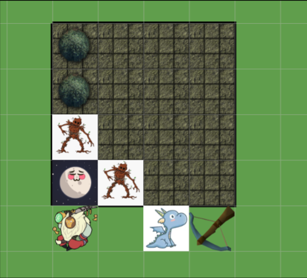
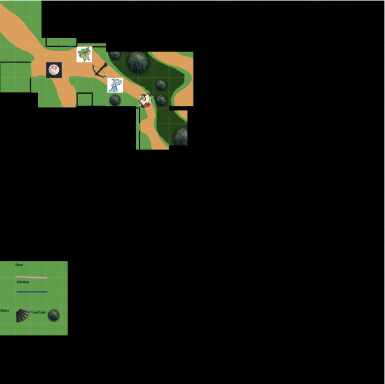
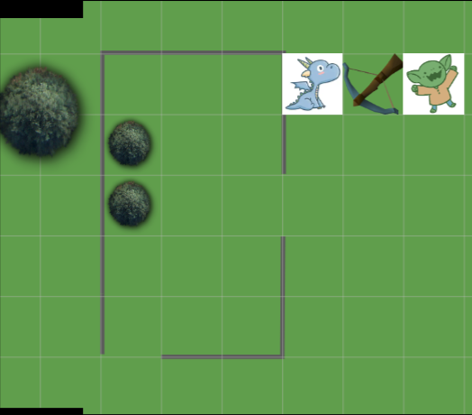
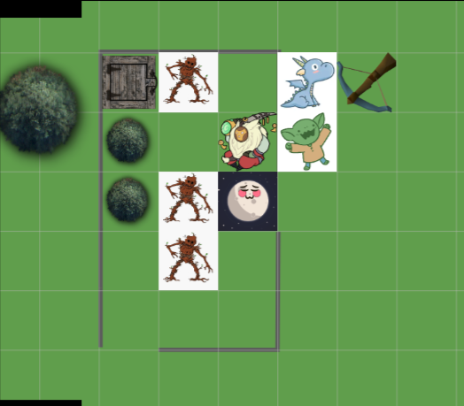
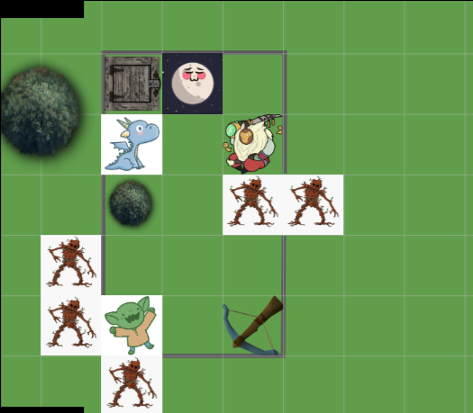

We make it to the large open gate of Never Winter and the Good Knights Inn. 

We head to the inn for food and drink. This is where we started our journeys. 

There are lots of adventureers. There is a symbole that we havent seen before on someones robes. Kawamoury goes to speek to them and comes back to us. They are the druids of Never Winter. 

The tear in the realm needs immediate attention and he leaves us. 

There is someone sitting at a table all alone. Aergo goes and convinces him to join our team. 

He is a tall bearded blunt nosed looking humaniod, grey stoney skin, red hair Firbolg. He tries to go sit on Arix. He is 10.5’ tall. His name is Jondrathron. The most normal name ever. No fear from him. He just wants to sit on the baby. 

He notices Droop and He casts a spell on himself to make himself look like a goblin. He scares droop more. 

I’m just hanging out having a beer watching this all go down. 

To become invisible, just think really hard about not being here according to the tall one. 

The bard tries to do the same thing. She drops a smoke bomb that basically didn’t work and she tried to sneak around us but we all saw her very very very very easily. 

We had a way too long of a discussion about the word, “snigger”. 

Sildar’s guild is here in Never Winter. But Radoff is in Thundertree. 

We decide to head out to look at the weapon shops. There is one that is ran by a dwarf. 

I ask if he has anything magical weaponwise for archers. He has none and suggests that there is another weapons smith down the street that should have some for a high price. 

The bard tricks the shop owner into thinking that she was getting married to Jon. He sells her a thieving toolkit for a discounted price. 

We head out to go for the other weapons shop that should have magical weapons. An older leady runs the shop and is talking with other customers currently. Everything is under lock and key. 

Never Winter is a port town, very large. Arix and droop head to the port. 

The shop owner has acid arrows. I buy 5 for 80 gold. 

[ACID ARROWS- On hit, the target takes 1d8 acid damage and must pass a 15DC con saving throw or suffer -2 to their AC and have disadvantage of con saving throws for 3 rounds (does not stack)]

Jon got a blanket. Aergo got a +1 short sword. 

I ask someone about Sildar's guild, the Lord's Alliance. It's a bit further into the city. I head that way. 

Aergo just fucking breaks down the door. Aergo asks for Sildar from some dude in the guild. Sildar isn't at the guild. He is at the trial for GassStaff. 

We head back to the tavern and run into Arix on the way. I pay for my room and food. 

We wake up and eat. We flip a coin and head out to Thundertree.

We make camp and sleep through the night. Nothing happens. 

We all hear Droop scream in the middle of the night and it wakes us all up. Apparently he is fine. 

We all fall back asleep. 

We get attacked by Orcs! 

I hop out the mother fucking porche and shoot and arrow at the orc next to droop. I deal a shit ton of damage. Fuck man I'm so good.

Aergo pulls out her +1 short sword. She whispers at the dude next to her and scares the bageeses out of him and scares him really far away. 

Jon does some unimpressive magic shit but somehow kills the dude anyways. 

Droop is attacked!!! HE GETS HIT BY A GREAT AXE IN THE CHEST AND FALLS UNCONSCIOUS! 

Arix rages and makes a stab for the guy next to him. He does a shit ton of damage. 

Overcome with emotion at the sight of seeing droop on the ground, there were tears in my eyes and I slightly miss the Orc next to him. 

Aergo kills the orc next to droop. Jon kills the one next to Aergo. 

Jon heals Droop. Droop is alive!

Arix brings down his great axe on the last orc and kills him. 

Arix runs to droop and picks him up. Droop gives him the thumbs that he is ok. 

No one is carrying arrows so I decided to not search for arrows. I search for other things. Found a little gold. No big deal. 

The rest of the night goes by without issue. 

We come upon an abandoned ruin. Plant monsters and zombies are afoot. It seems like this might be Thundertree. 

Jon goes into the building close by. It's a really run down building. 

There are plant monsters in there. Jon says, "Hello! How is your day treating you?"

They say and do nothing. "We mean you no harm. Have good day." and walk away. They do nothing. 

There is a fork in the road and we go down the left path. 

We come upon a ruined pair of cottages. They look as though they were owned by shop keepers or farmers. Jon steps in. 

There is a trap door in the building but also some plant monsters. 

ITS TIME TO DU-DU-DU-DU-DU-DUEL!

We were all surprised by this. 

I decide to just hang out and let my team carry me for once. 

The plant monsters are about three feet tall. They attack Aergo and Jon but they suck and missed. 

Droop hits one on the shoulder! 

Aergo attacks the one to her right and then attacks the one to her left. She is bad and missed both. Droop is better than you. 

Arix breaths hot air on them and they all die. 

I check them out and figure out what they are. They are kind of a plant. Like a walking plant. They are vulnerable to fire. 

Arix lifts up the trap door. There is a chest that Arix pulls out. 

5 more twigs attack! 

Droop and Aergo get attacked. 

Jon moves up on the bad guys and uses ice knife on the one in front of droop and deals exploding damage on everyone near there. 

I drop my bow and and pull out my short sword to swing at the one in front of me. They use their magic and use the vines on the wall to wrap up my sword. I let got of my sword and pull out my extra one and demolish the twig in front of me. 

Droop smacks the dude in front of him. 

Arix kicks the one in front of him and smashes him to bits. 

Jon attempts to attack the one in front of droop and the twig dodges it. He heals droop instead. 

I hang out to let Droop have some of the glory. Droop hits a crit and destroys the twig with his slingshot. 

I pick up my weapons. 