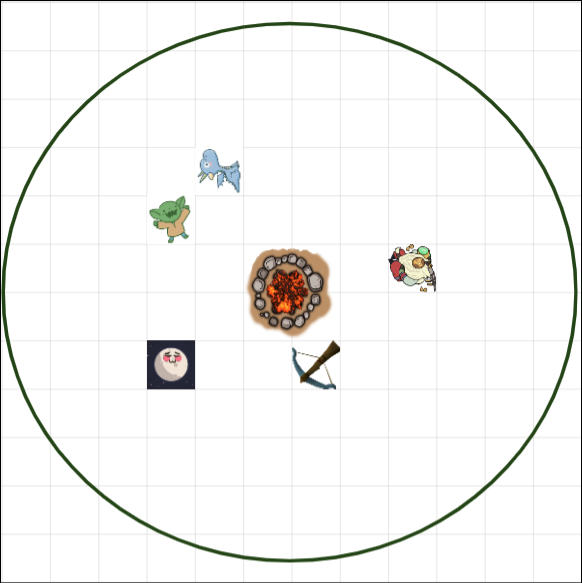
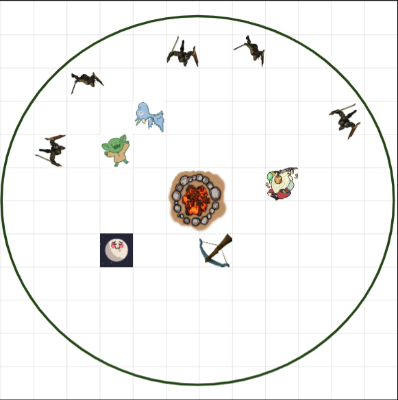

We make it to the large open gate of Never Winter and the Good Knights Inn. 

We head to the inn for food and drink. This is where we started our journeys. 

There are lots of adventureers. There is a symbole that we havent seen before on someones robes. Kawamoury goes to speek to them and comes back to us. They are the druids of Never Winter. 

The tear in the realm needs immediate attention and he leaves us. 

There is someone sitting at a table all alone. Aergo goes and convinces him to join our team. 

He is a tall bearded blunt nosed looking humaniod, grey stoney skin, red hair Firbolg. He tries to go sit on Arix. He is 10.5’ tall. His name is Jondrathron. The most normal name ever. No fear from him. He just wants to sit on the baby. 

He notices Droop and He casts a spell on himself to make himself look like a goblin. He scares droop more. 

I’m just hanging out having a beer watching this all go down. 

To become invisible, just think really hard about not being here according to the tall one. 

The bard tries to do the same thing. She drops a smoke bomb that basically didn’t work and she tried to sneak around us but we all saw her very very very very easily. 

We had a way too long of a discussion about the word, “snigger”. 

Sildar’s guild is here in Never Winter. But Radoff is in Thundertree. 

We decide to head out to look at the weapon shops. There is one that is ran by a dwarf. 

I ask if he has anything magical weaponwise for archers. He has none and suggests that there is another weapons smith down the street that should have some for a high price. 

The bard tricks the shop owner into thinking that she was getting married to Jon. He sells her a thieving toolkit for a discounted price. 

We head out to go for the other weapons shop that should have magical weapons. An older leady runs the shop and is talking with other customers currently. Everything is under lock and key. 

Never Winter is a port town, very large. Arix and droop head to the port. 

The shop owner has acid arrows. I buy 5 for 80 gold. 

[ACID ARROWS- On hit, the target takes 1d8 acid damage and must pass a 15DC con saving throw or suffer -2 to their AC and have disadvantage of con saving throws for 3 rounds (does not stack)]

Jon got a blanket. Aergo got a +1 short sword. 

I ask someone about Sildar's guild, the Lord's Alliance. It's a bit further into the city. I head that way. 

Aergo just fucking breaks down the door. Aergo asks for Sildar from some dude in the guild. Sildar isn't at the guild. He is at the trial for GassStaff. 

We head back to the tavern and run into Arix on the way. I pay for my room and food. 

We wake up and eat. We flip a coin and head out to Thundertree.

We make camp and sleep through the night. Nothing happens. 

We all hear Droop scream in the middle of the night and it wakes us all up. Apparently he is fine. 

We all fall back asleep. 

We get attacked by Orcs! 

